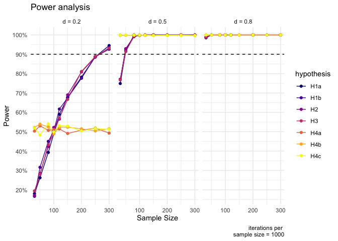

```{r, include=FALSE}
# load packages
library(tidyverse)
library(kableExtra)
library(lme4)
library(broom.mixed)
```

```{r, include=FALSE}
# make up some data to show code examples
# Set seed for reproducibility
set.seed(123)

# Read simulated data to demonstrate analytical procedure
experiment_data <- read_csv("data/simulated_experiment.csv")
validation_data <- read_csv("data/simulated_validation.csv")

```

# Introduction

Do people forget about the content that made them trust science? In two previous experiments (Experiments 1 and 2 in the same OSF repository), we have shown that exposure to impressive scientific content increases trust in the relevant scientists. In this experiment, we want to show that this increase of trust is not tied to recalling specific content.

The deficit model suggests that people do not trust science (enough), because they do not know enough about it. Accordingly, more knowledge about science generates trust. Here, we want to contrast this model with an alternative one: the trust-by-impression account. According to this model, people trust science at time T+1 not so much because they recall specific content at time T+1, but because they have been impressed by it at time T, and they remember this impression. We have aimed to test the model in another previous experiment (see Experiment 3, in the same OSF repository), where we quizzed participants about impressive scientific findings, either immediately after learning about them or after a distraction task. However, people's quiz performance did not vary between conditions--possibly because the quiz was generally too easy, and those questions which weren't easy were already hard to answer immediately after having read the text. In this fourth experiment, we introduce a new design to overcome some of these issues.

# Hypotheses

We first aim to replicate the results of Experiments 1 and 2, in a slightly different design: In the first two experiments we compared basic and impressive science texts in a between-participant design. Here, we just use the impressive version. As in the first two experiments, we will use questions asking directly about changes in participants' perceptions of the scientists' competence (e.g. "Would you agree that reading this text has made you think of archaeologists as more competent than you thought before?" [1 = Strongly disagree, 2 = Disagree, 3 = Neither agree nor disagree, 4 = Agree, 5 = Strongly agree]) and trust in the scientists' discipline ("Having read this text, would you agree that you trust the discipline of archaeology more than you did before?" [1 - Strongly disagree, 2 - Disagree, 3 - Neither agree nor disagree, 4 - Agree, 5 - Strongly agree]). In line with the findings of the first two experiments, we expect participants to have increased perceptions of competence and trust of scientists after reading the impressive text:

*H1a: Participants perceive scientists as more competent after having read an impressive text about their discipline's findings, compared to before.* 

*H1b: Participants trust a discipline more after having read an impressive text about the discipline's findings, compared to before.*

The main goal of Experiment 4 is to test whether increased perceptions of competence and trustworthiness are at least partly independent of being able to recall the specific content that induced them. By contrast to Experiment 3, we plan on using a more direct recall measure--an open ended text answer--and an even shorter time lag: We predict that people will not be able to recall all the information presented in the short vignettes right after having read them.

*H2: Participants are not able to recall all the information of the original texts.*

This hypothesis, however, only tests whether people forget any of the content, potentially including non impressive content. To address this issue, we will ask participants, for each or the pieces of knowledge contained in the text, to tell us whether they found it impressive or not. Based on the items they select as impressive, we can then test the hypothesis that participants will have also forgotten some of the impressive content:

*H3: Participants are not able to recall all the impressive information--as rated by themselves--contained in the original text.*

Finally, we will introduce another measure of the impressiveness of the texts remembered by the participants, using a different set of participants in a subsequent study. We refer to this study as the “validation study” here. We predict that participants in the validation study will be less impressed by the open-ended answers produced by the participants of Experiment 4, and accordingly will have less positively altered perceptions of the scientists' competence and the trustworthiness of their discipline, compared to the original texts. 

*H4a: The texts produced by participants of the experiment as a result of the recall task will be less impressive than the original texts, as rated by participants of the validation study.*

*H4b: Participants of the validation study perceive scientists as more competent after having read the original texts, compared to after having read the texts produced by participants of the experiment as a result of the recall task.*

*H4c: Participants of the validation study trust a discipline more after having read the original texts, compared to after having read the texts produced by participants of the experiment as a result of the recall task.*

We further expect the differences that we observe via experimental manipulation in the validation study to replicate when comparing impressiveness, competence, and trust ratings between the sample of the experiment and the participant-text condition of the validation study. However, we will not explicitly pre-register these predictions, as it is cleaner to test this within the validation study. 

# Data collection

No data has been collected yet. We ran a pilot study to investigate how people perform in answering open-ended recall questions both right after having read the original text, and two days after. The answers suggested that participants forget a fair amount of information even right after.

# Design

## Procedure

### Experiment

Participants will first be asked if they agree to a consent form and given an attention check (see part exclusion criteria). Participants will be randomly assigned to the archaeology or the entomology condition. They will read a vignette--either about entomologists or archaeologists, depending on their condition--established as impressive and trust/competence enhancing in previous experiments (Table \@ref(tab:stimuli)). After reading the text, participants will be asked about changes in their perception of the scientists' competence (e.g. "Would you agree that reading this text has made you think of archaeologists/entomologists as more competent than you thought before?" [1 = Strongly disagree, 2 = Disagree, 3 = Neither agree nor disagree, 4 = Agree, 5 = Strongly agree]) and trust in the scientists' discipline ("Having read this text, would you agree that you trust the discipline of archaeology/entomology more than you did before?" [1 - Strongly disagree, 2 - Disagree, 3 - Neither agree nor disagree, 4 - Agree, 5 - Strongly agree]). They will also be asked about the impressiveness of the text they read: "How impressive did you find the findings of the entomologists described in the text you have read?" (5-point scale: 1 = not impressive at all, 2 = not very impressive, 3 = neither impressive nor unimpressive, 4 = quite impressive, 5 = very impressive). The order of these questions will be randomized. 

Next, participants will have to do a recall task: They will be asked to rewrite the text from memory. They will be told that their texts will be read by future participants. To motivate participants to write down everything they remember, they will also be told that they will get a bonus for recalling as much accurate information as possible (without external aids). They will not be told how much that bonus will be. We will pay them 5p, or 0.05 pound, per point gained in the recall task. This way, participants can reach a maximum bonus of 0.8 pound for archaeology (0.05 x 2 x 8) and 0.7 pound (0.05 x 2 x 7) for entomology.

After the recall task, participants will be presented with the evaluation grid that we use to asses the open answers from the recall task (see Table \@ref(tab:knowledge-evaluation-grid)), for the respective discipline they had read about. For each information element separately, we ask participants to indicate whether they found it impressive or not ("Do you think this piece of information is impressive?" - "Yes" / "No"). Finally, participants will be asked about their education level.

### Validation study

To validate the impressiveness of the answers participants provided in the experiment, we will run a validation study. For this study, a new sample of participants will be recruited. Participants of this new sample will be randomly assigned to one of two conditions: In the "original text" condition, participants will be assigned to read one of the two texts of the original experiment, again picked randomly. In the "recall text" condition participants will read one of the recall texts written by the participants' of the experiment. Whether the content will be about archaeologists or entomologists will be assigned randomly. For each participant, we will randomly sample one text (with replacement) from the pool of all recall answers for the respective discipline from the experiment. Orthographic and grammatical mistakes in these texts will be corrected with the help of ChatGPT beforehand.

The procedure for the new participants is similar to the main experiment, but does not involve neither a recall task nor impressiveness ratings of particular information elements. The participants will first be asked if they agree to a consent form and pass an attention check (see part exclusion criteria). Then, each participant will be presented with text corresponding to their condition. After reading the text, just as in the experiment, participants will be asked about changes in their perception of the scientists' competence (e.g. "Would you agree that reading this text has made you think of archaeologists/entomologists as more competent than you thought before?" [1 = Strongly disagree, 2 = Disagree, 3 = Neither agree nor disagree, 4 = Agree, 5 = Strongly agree]) and trust in the scientists' discipline ("Having read this text, would you agree that you trust the discipline of archaeology/entomology more than you did before?" [1 - Strongly disagree, 2 - Disagree, 3 - Neither agree nor disagree, 4 - Agree, 5 - Strongly agree]). They will also be asked about the impressiveness of the text they read: "How impressive did you find the findings of the entomologists described in the text you have read?" (5-point scale: 1 = not impressive at all, 2 = not very impressive, 3 = neither impressive nor unimpressive, 4 = quite impressive, 5 = very impressive). The order of these questions will be randomized. Finally, participants will be asked about their education level.

## Materials

Table \@ref(tab:stimuli) shows the vignettes we will use in Experiment 4. Table \@ref(tab:knowledge-evaluation-grid) shows the evaluation grid we will use to evaluate the content of participants' open-ended answers, and which participants will see towards the end of the experiment when making a selection of the most impressive elements.

```{r stimuli, echo=FALSE}
# Create a matrix of image file paths as Markdown-formatted strings
table <- data.frame(
  archaeology = "Archaeologists, scientists who study human history and prehistory, are able to tell, from their bones, whether someone was male or female, how old they were, and whether they suffered from a range of diseases. Archaeologists can now tell at what age someone, dead for tens of thousands of years, stopped drinking their mother’s milk, from the composition of their teeth.

Archaeologists learn about the language that our ancestors or cousins might have had. For instance, the nerve that is used to control breathing is larger in humans than in apes, plausibly because we need more fine-grained control of our breathing in order to speak. As a result, the canal containing that nerve is larger in humans than in apes – and it is also enlarged in Neanderthals.

Archaeologists can also tell, from an analysis of the tools they made, that most Neanderthals were right-handed. It’s thought that handedness is related to the evolution of language, another piece of evidence suggesting that Neanderthals likely possessed a form of language.
",
  Entomology = "Entomologists are the scientists who study insects. Some of them have specialized in understanding how insects perceive the world around them, and they have uncovered remarkable abilities. 

Entomologists interested in how flies’ visual perception works have used special displays to present images for much less than the blink of an eye, electrodes to record how individual cells in the flies’ brain react, and ultra-precise electron microscopy to examine their eyes. Thanks to these techniques, they have shown that some flies can perceive images that are displayed for just three milliseconds (a thousandth of a second) – about ten times shorter than a single movie frame (of which there are 24 per second). 

Entomologists who study the hair of crickets have shown that these microscopic hairs, which can be found on antenna-like organs attached to the crickets’ rear, are maybe the most sensitive organs in the animal kingdom. The researchers used extremely precise techniques to measure how the hair reacts to stimuli, such as laser-Doppler velocimetry, a technique capable of detecting the most minute of movements. They were able to show that the hair could react to changes in the motion of the air that had less energy than one particle of light, a single photon.
"
)

# Use kable() to create the table and print it as Markdown
kableExtra::kable(table, 
                  col.names = c( "Archaeology", "Entomology"),
                  caption = "Stimuli",
                  align = "l", 
                  booktabs = T,
                  longtable = TRUE) %>%
  kable_paper(full_width = FALSE) %>%
  column_spec(1, width = "20em") %>%
  column_spec(2, width = "20em") 
```

```{r knowledge-evaluation-grid, echo=FALSE}
# Create the data frame with consistent row numbers
new_table <- data.frame(
  Archaeology = linebreak(c(
  "1. Archaeologists can determine whether someone was male or female from their bones.",
  "2. Archaeologists can determine how old someone was from their bones.",
  "3. Archaeologists can determine whether someone suffered from a range of diseases from their bones.",
  "4. Archaeologists can determine at what age someone stopped drinking their mother’s milk, based on the composition of their teeth.",
  "5. The nerve controlling breathing is larger in humans than in apes. The canal containing that nerve is also larger in humans and Neanderthals than in apes.",
  "6. The fact that the nerve controlling breathing is larger in humans is possibly due to the need for fine-grained control of breathing to speak.",
  "7. Archaeologists determined that most Neanderthals were right-handed, based on analysis of Neanderthals’ tools.",
  "8. Handedness is thought to be related to the evolution of language. This suggests that Neanderthals likely possessed a form of language."
)),
Entomology = linebreak(c(
  "1. Entomologists use special displays to present images to flies for extremely short periods (less than the blink of an eye).",
  "2. Entomologists can record how individual cells in flies’ brains react using electrodes.",
  "3. Entomologists use ultra-precise electron microscopy to examine flies’ eyes.",
  "4. Some flies can perceive images displayed for just three milliseconds. This duration is about ten times shorter than a single movie frame.",
  "5. Crickets have microscopic hairs situated on antenna-like organs at their rear. ",
  "6. Crickets' hairs are possibly the most sensitive organs in the animal kingdom. They react to changes in air motion with less energy than one photon.",
  "7. Entomologists measured how cricket hairs react to stimuli, using laser-Doppler velocimetry, which can detect extremely minute movements.",
  ""  # Placeholder to match vector length
))
)

# Render the table with line breaks and PDF-compatible formatting
kableExtra::kable(
  new_table,
  col.names = c("Archaeology", "Entomology"),
  caption = "Recall evaluation grid",
  align = "l",
  booktabs = TRUE,
  format = "latex",
  longtable = TRUE,
  escape = FALSE # Keep LaTeX formatting
) %>%
  kable_paper(full_width = FALSE) %>% # Ensure consistentf styling
  column_spec(1, width = "20em") %>%  # Adjust column widths
  column_spec(2, width = "20em")

```

```{r echo=FALSE}
# write csv with inclusion critera for human coders
write_csv(new_table, "data/knowledge_elements.csv")
```


### Outcome measures

Our Likert-scale outcome measures are already described in the procedure section. Here, we will provide details on our recall measure, as well as on the personal perceived loss of impressiveness measure.

**Recall**. As shown in Table \@ref(tab:knowledge-evaluation-grid), we divided the text into different information elements. For each participant, we calculate a recall score based on how many of these elements they mention in their open-ended answer. We will code 0 if a piece of knowledge is not mentioned, or it is mentioned with very important mistakes (e.g. writing “the nerve controlling fine hand movement is bigger in humans” instead of “the nerve controlling breathing is bigger in humans”). We will code 1 if the piece of knowledge is mentioned, but some important elements are missing (e.g. writing “Archaeologists can determine at what age someone stopped drinking their mother’s milk” instead of « Archaeologists can determine at what age someone stopped drinking their mother’s milk from the composition of their teeth »), and/or there are some mistakes (e.g. writing “Archaeologists can determine at what age someone stopped drinking their mother’s milk, based on the bones” instead of “Archaeologists can determine at what age someone stopped drinking their mother’s milk based on the teeth”). We will code 2 if the piece of knowledge is mentioned with all the main content, even if the participant has not used the precise technical words (e.g. “neanderthals”, “laser-Doppler velocimetry”) or has changed the phrasing of the information in other ways. We will code participants answers with the help of ChatGPT. We will provide ChatGPT with the evaluation grid and the following prompt:

> **Prompt ChatGPT**: *“In an experiment, participants read the following vignette : […]. Then, participants are asked to write what they recall from the vignette. Evaluate whether the following piece of information is included in the participant’s text : […]. You should give one of three grades : 0 = the piece of knowledge is not mentioned, or it is mentioned with very important mistakes (e.g. writing “the nerve controlling fine hand movement is bigger in humans” instead of “the nerve controlling breathing is bigger in humans”). 1 = the piece of knowledge is mentioned, but some important elements are missing (e.g. writing “Archaeologists can determine at what age someone stopped drinking their mother’s milk” instead of « Archaeologists can determine at what age someone stopped drinking their mother’s milk from the composition of their teeth »), and/or there are some mistakes (e.g. writing “Archaeologists can determine at what age someone stopped drinking their mother’s milk, based on the bones” instead of “Archaeologists can determine at what age someone stopped drinking their mother’s milk based on the teeth”). 2 = the piece of knowledge is mentioned with all the main elements. Note: a grade of 2 is attributed even if the participant has not used the precise technical words (e.g. “neanderthals”, “laser-Doppler velocimetry”) or has changed the phrasing of the information in other ways. Provide a brief explanation, and conclude the explanation with the score formatted as Score= followed by the numerical value, with no text or symbol after the score. Here is the participant’s text: […].” 
*

To validate the scores assigned by ChatGPT, we will compare it to scores assigned by two human coders for a sub sample of 80 randomly chosen texts (half on archaeology, half on entomology). The human coders will be unaware of the study context and the hypotheses. They will read as instructions the same prompt provided to ChatGPT. They will receive minimal training on some texts obtained in a pilot study. To measure the reliability between ChatGPT coding and human coding, we will calculate an ICC of inter-rater agreement for two-way designs with random raters [@tenhoveUpdatedGuidelinesSelecting2024]. Following the guidelines of @heymanBehavioralObservationCoding2014, we will take 0.7 as a threshold for acceptable reliability. If we meet this threshold, we will only use ChatGPT evaluations for constructing the recall scores. If we do not, we will qualitatively investigate differences in decisions for human coders and ChatGPT. After this assessment, we might try to use a different prompt for ChatGPT and/or add other human coders.

Since the two vignettes contain a slightly different number of total information elements according to our evaluation grid (8 for archaeology, 7 for entomology), we use a relative measure for the final recall score, namely the share of obtained points among all possible points.

**Recall of impressive items**. After having given their post evaluation of scientists' competence and trust in the different disciplines, participants will be presented with the evaluation grid shown in Table \@ref(tab:knowledge-evaluation-grid), for the respective discipline they had been randomized to see. For each element in the evaluation grid, they are asked whether they find it impressive or not. For each participants, we will compute the recall score they obtained on those elements they subjectively rated to be impressive. Since the number of items seen as impressive varies within participants, the final recall measure for impressive elements will be a relative one, namely the share of points among all possible points for the items rated as impressive by the participant.

# Analytical procedure

Although our hypotheses are directional, we will use two sided tests for all hypothesis, in order to have a more conservative test. 

```{r}
# initialize an empty results data frame
results <- data.frame(
  hypothesis = character(),
  test_type = character(),
  statistic = numeric(),
  p_value = numeric(),
  mean_difference = numeric(),
  stringsAsFactors = FALSE
)
```

For the first set of hypotheses, we will a one-sample t-tests, to check if the average score is significantly different from the scale midpoint. Practically, we will subtract the scale mid-point from from all answers, and then test if the resulting scores are statistically different from 0^[note that we simulated standardized data, so in the sample code snippets, we won't do this procedure].

```{r}
# H1a: One-sample t-test for change in competence
if (shapiro.test(experiment_data$change_competence)$p.value > 0.05) {
  h1a <- t.test(experiment_data$change_competence, mu = 0)
  results <- rbind(results, data.frame(
    hypothesis = "H1a",
    test_type = "one sample t-test",
    statistic = h1a$statistic,
    p_value = h1a$p.value,
    mean_difference = h1a$estimate
  ), row.names = NULL)
} else {
  h1a <- wilcox.test(experiment_data$change_competence, mu = 0, exact = FALSE)
  results <- rbind(results, data.frame(
    hypothesis = "H1a",
    test_type = "Wilcoxon",
    statistic = h1a$statistic,
    p_value = h1a$p.value,
    mean_difference = NA
  ), row.names = NULL)
}

# H1b: One-sample t-test for change in trust
if (shapiro.test(experiment_data$change_trust)$p.value > 0.05) {
  h1b <- t.test(experiment_data$change_trust, mu = 0)
  results <- rbind(results, data.frame(
    hypothesis = "H1b",
    test_type = "one sample t-test",
    statistic = h1b$statistic,
    p_value = h1b$p.value,
    mean_difference = h1b$estimate
  ), row.names = NULL)
} else {
  h1b <- wilcox.test(experiment_data$change_trust, mu = 0, exact = FALSE)
  results <- rbind(results, data.frame(
    hypothesis = "H1b",
    test_type = "Wilcoxon",
    statistic = h1b$statistic,
    p_value = h1b$p.value,
    mean_difference = NA
  ), row.names = NULL)
}

# check by calling the data frame
# results
```

For H2, we want to test if the recall score is statistically different from perfect recall. Another way of framing this is whether the average forgetting score (1-recall score, since recall score is a percentage) differs significantly from zero. If the forgetting scores are approximately normally distributed, we will run a one-sample t-test. If not, we will revert to the non-parametric equivalent, the Wilcoxon signed-rank test.

```{r}
# H2: Test forgetting score against zero
if (shapiro.test(experiment_data$forgetting_score)$p.value > 0.05) {
  h2 <- t.test(experiment_data$forgetting_score, mu = 0)
  results <- rbind(results, data.frame(
    hypothesis = "H2",
    test_type = "one sample t-test",
    statistic = h2$statistic,
    p_value = h2$p.value,
    mean_difference = h2$estimate
  ), row.names = NULL)
} else {
  h2 <- wilcox.test(experiment_data$forgetting_score, mu = 0, exact = FALSE)
  results <- rbind(results, data.frame(
    hypothesis = "H2",
    test_type = "Wilcoxon",
    statistic = h2$statistic,
    p_value = h2$p.value,
    mean_difference = NA
  ), row.names = NULL)
}

# check by calling the data frame
# results
```

For H3, we want to test if the recall score for impressive elements is statistically different from perfect recall of these elements. As for H2, another way of framing this is whether the average forgetting score for the elements judged as impressive (1- personal impressive recall score) differs significantly from zero.

```{r}
# H3: One-sample test for impressive forgetting score against zero
if (shapiro.test(experiment_data$impressive_forgetting_score)$p.value > 0.05) {
  h3 <- t.test(experiment_data$impressive_forgetting_score, mu = 0)
  results <- rbind(results, data.frame(
    hypothesis = "H3",
    test_type = "one sample t-test",
    statistic = h3$statistic,
    p_value = h3$p.value,
    mean_difference = h3$estimate
  ), row.names = NULL)
} else {
  h3 <- wilcox.test(experiment_data$impressive_forgetting_score, mu = 0, exact = FALSE)
  results <- rbind(results, data.frame(
    hypothesis = "H3",
    test_type = "Wilcoxon",
    statistic = h3$statistic,
    p_value = h3$p.value,
    mean_difference = NA
  ), row.names = NULL)
}

# check by calling the data frame
# results
```

For H4a, b and c, we will compare trust, competence and impressiveness ratings between the "original texts" and the "recall texts" condition of the validation study using an independent sample t-tests.

```{r}
# H4a: Independent t-test for text impressiveness
h4a <- t.test(
  impressiveness ~ condition,
  data = validation_data
)
results <- rbind(results, data.frame(
  hypothesis = "H4a",
  test_type = "independent t-test",
  statistic = h4a$statistic,
  p_value = h4a$p.value,
  mean_difference = h4a$estimate[[1]] - h4a$estimate[[2]]
))

# H4b: Independent t-test for competence change
h4b <- t.test(
  competence ~ condition,
  data = validation_data
)
results <- rbind(results, data.frame(
  hypothesis = "H4b",
  test_type = "independent t-test",
  statistic = h4b$statistic,
  p_value = h4b$p.value,
  mean_difference = h4b$estimate[[1]] - h4b$estimate[[2]]
))

# H4c: Independent t-test for trust change
h4c <- t.test(
  trust ~ condition,
  data = validation_data
)
results <- rbind(results, data.frame(
  hypothesis = "H4c",
  test_type = "independent t-test",
  statistic = h4c$statistic,
  p_value = h4c$p.value,
  mean_difference = h4c$estimate[[1]] - h4c$estimate[[2]]
))

# check by calling the data frame
# results
```

# Exclusions

Participants will be asked to complete the following attention check at the beginning of the experiment:

> *“Please answer 'Strongly agree' to this question to show you are paying attention.
1. Strongly disagree
2. Somewhat disagree
3. Neither agree nor disagree
4. Somewhat agree
5. Strongly agree” 
*

Participants who do not answer correctly will be excluded from the analysis. 

# Power simulation

We ran a power simulation to inform our choice of sample size. All assumptions and details on the procedure can be found in the `power_exp4.Rmd` document. Fig. \@ref(fig:power-plot) displays the results of this simulation, for different sample sizes of the main experiment, and different effect sizes (same effect size assumed for all hypotheses). For all simulations, we assumed a constant validation study sample size of 400 participants (only relevant for H4). The power simulation suggests that we reach a power level of 90% when assuming a medium effect size of 0.5 with already 50 participants. We consider that good enough, but due to uncertainty about our assumptions, we will recruit a sample 200 participants for the main experiment. We will recruit 400 participants for the validation study. Although this was not the focus of our simulation, our results show that for a medium effect size of 0.5, a sample size of 400 for the validation study yields statistical power of greater than 90% for all hypotheses based on this sample (H4a, b and c). Participants for both studies will be from the UK. They will be recruited on the online platform Prolific, and paid to complete the experiment.

(ref:power-plot) Results of Knowledge scores from participants in a pilot study.

```{r power-plot, echo=FALSE, fig.cap="(ref:power-plot)", out.width = "80%", fig.align="center"}

```

# References

