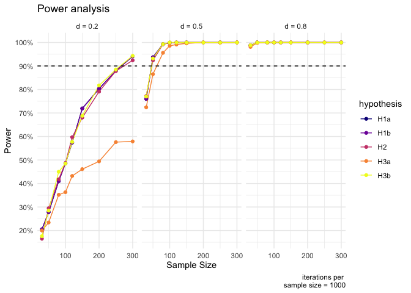

```{r, include=FALSE}
# load packages
library(tidyverse)
library(kableExtra)
library(lme4)
library(broom.mixed)
```

```{r, include=FALSE}
# make up some data to show code examples
# Set seed for reproducibility
set.seed(123)

# Read simulated data to demonstrate analytical procedure
experiment_data <- read_csv("data/simulated_experiment.csv")
validation_data <- read_csv("data/simulated_validation.csv")

```

# Introduction and Hypotheses

Do people forget about the content that made them trust science? In two previous experiments (Experiments 1 and 2 in the same OSF repository), we have shown that exposure to impressive scientific content increases trust in scientists. In this experiment, we want to show that this increase of trust is not tied to recalling specific content.

The deficit model suggests that people do not trust science (enough), because they do not know enough about it. Accordingly, more knowledge about science generates trust. Here, we want to contrast this model with an alternative one: the trust-by-impression account. According to this model, people trust science at time T+1 not so much because they recall specific content at time T+1, but because they have been impressed by it at time T. We have aimed to test the model in another previous experiment (see Experiment 3, in the same OSF repository), where we quizzed participants about impressive scientific findings, either immediately after learning about them or after a distraction task. However, people's quizz performance did not vary between conditions--possibly because the quiz was generally too easy, and those questions which weren't easy were already hard to answer immediately after having read the text. 

In this fourth experiment, we first aim to replicate the results of Experiments 1 and 2, in a slightly different design: In the first two experiments we compared basic and impressive science texts in a between participant design. Here, we just use the impressive version in a within-participant design, in which we compare pre-and post intervention scores. In the first two experiments we used question asking about difference in trust/competence (e.g. "Would you agree that reading this text has made you think of archaeologists as more competent than you thought before?" [1 = Strongly disagree, 2 = Disagree, 3 = Neither agree nor disagree, 4 = Agree, 5 = Strongly agree]). Here, we just use a standard measure (e.g. "How competent do you think entomologists are? (7-point scale: 1 = exceptionally incompetent, 2 = very incompetent, 3 = quite incompetent, 4 = neither competent nor incompetent, 5 = quite competent, 6 = very competent, 7 = exceptionally competent)) and compute the difference of the pre and post score. As for the first experiments, we expect participants to have increased perceptions of competence and trust of scientists after reading the impressive text:

*H1a: Participants will perceive scientists as more competent after having read an impressive text about their discipline's findings, compared to before.* 

*H1b: Participants will trust a discipline more after reading an impressive text about the discipline's findings, compared to before.*

The second aim of Experiment 4 is to test whether increased perceptions of competence and trustworthiness are at least partly independent of being able to recall the specific that induced them. By contrast to Experiment 3, we plan on using a more direct recall measure--an open ended text answer--and an even shorter time lag. We predict that people will not be able to recall all the information presented in the short vignettes right after having read them.

*H2: Participants will not be able to recall all the information of the impressive texts.*

This hypothesis, however, only tests whether people forget any of the content. We also need to establish  that the forgotten content was relevant for generating impressions of trustworthiness and competence in the first place. Therefore, we make the additional prediction that the texts participants will produce in the recall task will contain less impressive content than the original texts. We evaluate this in two ways.

First, we will present participants’ recall task answers to a different set of participants in a subsequent study. We refer this study as the "validation study" here. We predict that participants in the validation study will be less impressed by the open-ended answers produced by the participants of Experiment 4, compared to the original texts (do we test that in a between design in the validation study, or do we compare the numbers between the two samples - I guess we could do the latter if sufficiently short time interval between the two).

*H3a: The texts produced by participants as a result of the recall task will be less impressive than the original texts, as rated by another sample of participants.*

If we confirm this hypothesis, it would suggest that participants are not able to recall at least some knowledge that--on average--has contributed to changing impressions of competence and trustworthiness. The emphasis, however, is on "on average": It could still be that what generates impressiveness (and thus alters perceptions of competence and trust) is highly subjective - it could vary a lot from participant to participant.

If this were the case, in our validation study we might create mismatches such that what was impressive to the particular original participant generating the text was not impressive to the particular evaluate(s) in the second experiment. Therefor, we will add an additional prediction: At the end of the experiment 4, after having done the recall task, we provide participants with our evaluation grid of all the information contained in the original vignettes. We ask them to select the, say, 5 (out of 10) points that they find most impressive. We then test whether to which extent participants had recalled the information they rated as most impressive themselves (Actually, if we do this, we might not even need the second study for external validation?).

*H3b: The texts produced by participants as a result of the recall task will be less impressive than the original texts, as rated by the participants themselves.*

If we confirm both H3a and H3b, we conclude that at least some content that has generated impressions of increased trustworthiness and competence has been forgotten even right after.

Issue: critics can tell us that participants have not been motivated to write a lot, so obvioulsy they'll write less.

# Data collection

No data has been collected yet. We ran a pilot study to investigate how people perform in answering open ended-recall questions both right after having read the original text, and two days after. The answers suggested that participants forget a fair amount of information even right after. However, we have not tried to quantify, let alone formally test this.

# Design

## Procedure

### Experiment

Participants will first be asked if they agree to a consent form and given an attention check (see part exclusion criteria). Then, participants will be asked to answer the following questions about three categories of scientists (1. molecular physicists, 2. immunologists, 3. either archaeologists or entomologists): "How competent do you think [molecular physicists] are?" (7-point scale: 1 = exceptionally incompetent, 2 = very incompetent, 3 = quite incompetent, 4 = neither competent nor incompetent, 5 = quite competent, 6 = very competent, 7 = exceptionally competent); "How much do you trust the discipline of [molecular physicists]?" (7-point scale: 1 = no trust at all, 2 = almost no trust, 3 = very little trust, 4 = some trust, 5 = quite strong trust, 6 = very strong trust, 7 = absolute trust). Participants will be randomly assigned to the archaeology condition or the entomology condition. After answering the questions, participants will read a vignette--either about entomologists or archaeologists, depending on their condition--established as impressive and trust/competence enhancing in previous experiments (Table \@ref(tab:stimuli)).

After reading the text, participants will be asked the same questions as in the beginning about the competence of scientists and trust in their respective discipline, for the different groups of scientists. Then, participants will be asked to rewrite the text from memory. They will be told that their texts will be read by future participants. After the recall task, we will ask participants about the impressiveness of the text: "How impressive did you find the findings of the entomologists described in the text you have read?" (5-point scale: 1 = not impressive at all, 2 = not very impressive, 3 = neither impressive nor unimpressive, 4 = quite impressive, 5 = very impressive). Participants will then be presented with the evaluation grid for the open answers (see Table \@ref(tab:knowledge-evaluation-grid)), and rate which 5 pieces of information (out of XX) they rate as most impressive. Finally, participants will be asked about their education level.

### Validation study

To validate the impressiveness of the answers participants provided in the experiment, we will run a validation study. For this study, a new sample of participants will be recruited. The procedure for the new participants is similar to the main experiment, but does not involve the recall task or questions about scientific disciplines other than the one they read about. The participants will first be asked if they agree to a consent form and pass an attention check (see part exclusion criteria). Participants will be asked about their perceptions of the competence of scientists and their trust in the scientific discipline, for either archaeology or entomology: “How competent do you think [entomologists] are?” (7-point scale: 1 = exceptionally incompetent, 2 = very incompetent, 3 = quite incompetent, 4 = neither competent nor incompetent, 5 = quite competent, 6 = very competent, 7 = exceptionally competent); “How much do you trust the discipline of [entomology]?” (7-point scale: 1 = no trust at all, 2 = almost no trust, 3 = very little trust, 4 = some trust, 5 = quite strong trust, 6 = very strong trust, 7 = absolute trust).

Then, each participant will be presented with one (randomly chosen) of the texts produced by the phase 1 participants. Orthographic and grammatical mistakes will be corrected with the help of ChatGPT beforehand. Participants will be asked the following question: "How impressive did you find the findings of the entomologists described in the text you have read?" (5-point scale: 1 = not impressive at all, 2 = not very impressive, 3 = neither impressive nor unimpressive, 4 = quite impressive, 5 = very impressive). Finally, participants will be asked about their education level.

## Materials

Table \@ref(tab:stimuli) shows the vignettes we will use in Experiment 4. Table \@ref(tab:knowledge-evaluation-grid) shows the evaluation grid we will use to evaluate the content of participants open-ended answers, and which participants will see towards the end of the experiment when making a selection of the most impressive elements.

```{r stimuli, echo=FALSE}
# Create a matrix of image file paths as Markdown-formatted strings
table <- data.frame(
  archaeology = "Archaeologists, scientists who study human history and prehistory, are able to tell, from their bones, whether someone was male or female, how old they were, and whether they suffered from a range of diseases. Archaeologists can now tell at what age someone, dead for tens of thousands of years, stopped drinking their mother’s milk, from the composition of their teeth.

Archaeologists learn about the language that our ancestors or cousins might have had. For instance, the nerve that is used to control breathing is larger in humans than in apes, plausibly because we need more fine-grained control of our breathing in order to speak. As a result, the canal containing that nerve is larger in humans than in apes – and it is also enlarged in Neanderthals.

Archaeologists can also tell, from an analysis of the tools they made, that most Neanderthals were right-handed. It’s thought that handedness is related to the evolution of language, another piece of evidence suggesting that Neanderthals likely possessed a form of language.
",
  Entomology = "Entomologists are the scientists who study insects. Some of them have specialized in understanding how insects perceive the world around them, and they have uncovered remarkable abilities. 

Entomologists interested in how flies’ visual perception works have used special displays to present images for much less than the blink of an eye, electrodes to record how individual cells in the flies’ brain react, and ultra-precise electron microscopy to examine their eyes. Thanks to these techniques, they have shown that some flies can perceive images that are displayed for just three milliseconds (a thousandth of a second) – about ten times shorter than a single movie frame (of which there are 24 per second). 

Entomologists who study the hair of crickets have shown that these microscopic hairs, which can be found on antenna-like organs attached to the crickets’ rear, are maybe the most sensitive organs in the animal kingdom. The researchers used extremely precise techniques to measure how the hair reacts to stimuli, such as laser-Doppler velocimetry, a technique capable of detecting the most minute of movements. They were able to show that the hair could react to changes in the motion of the air that had less energy than one particle of light, a single photon.
"
)

# Use kable() to create the table and print it as Markdown
kableExtra::kable(table, 
                  col.names = c( "Archaeology", "Entomology"),
                  caption = "Stimuli",
                  align = "l", 
                  booktabs = T,
                  longtable = TRUE) %>%
  kable_paper(full_width = FALSE) %>%
  column_spec(1, width = "20em") %>%
  column_spec(2, width = "20em") 
```

```{r knowledge-evaluation-grid, echo=FALSE}
# Create the data frame with consistent row numbers
new_table <- data.frame(
  Archaeology = linebreak(c(
  "1. Archaeologists can determine whether someone was male or female from their bones.",
  "2. Archaeologists can determine how old someone was from their bones.",
  "3. Archaeologists can determine whether someone suffered from a range of diseases from their bones.",
  "4. Archaeologists can determine at what age someone stopped drinking their mother’s milk, based on the composition of their teeth.",
  "5. Archaeologists learn about the language capabilities of our ancestors or cousins.",
  "6. The nerve controlling breathing is larger in humans than in apes. This is possibly due to the need for fine-grained control of breathing to speak.",
  "7. The canal containing that nerve is larger in humans and Neanderthals than in apes.",
  "8. Archaeologists determined that most Neanderthals were right-handed, based on analysis of Neanderthals’ tools.",
  "9. Handedness is thought to be related to the evolution of language. This suggests that Neanderthals likely possessed a form of language."
)),
Entomology = linebreak(c(
  "1. Some entomologists study how flies’ visual perception works.",
  "2. They use special displays to present images for extremely short periods (less than the blink of an eye).",
  "3. They can record how individual cells in flies’ brains react using electrodes.",
  "4. They use ultra-precise electron microscopy to examine flies’ eyes.",
  "5. Some flies can perceive images displayed for just three milliseconds (a thousandth of a second). This duration is about ten times shorter than a single movie frame.",
  "6. Some entomologists study the microscopic hairs situated on crickets’ antenna-like organs at their rear.",
  "7. Researchers measured how cricket hairs react to stimuli, using laser-Doppler velocimetry, which can detect extremely minute movements.",
  "8. These hairs are possibly the most sensitive organs in the animal kingdom. Crickets’ hair reacts to changes in air motion with less energy than one photon (a single particle of light).",
  ""  # Placeholder to match vector length
))
)

# Render the table with line breaks and PDF-compatible formatting
kableExtra::kable(
  new_table,
  col.names = c("Archaeology", "Entomology"),
  caption = "Recall evaluation grid",
  align = "l",
  booktabs = TRUE,
  format = "latex",
  longtable = TRUE,
  escape = FALSE # Keep LaTeX formatting
) %>%
  kable_paper(full_width = FALSE) %>% # Ensure consistentf styling
  column_spec(1, width = "20em") %>%  # Adjust column widths
  column_spec(2, width = "20em")

```

### Outcome measures

Our Likert-scale outcome measures are already described in the procedure section. Here, we will provide details on our recall measure, as well as on the personal perceived loss of impressiveness measure.

**Recall**. As shown in Table \@ref(tab:knowledge-evaluation-grid), we divided the text into different information elements. For each participant, we calculate a recall score based on how many of these elements they mention in their open-ended answer. We will code 0 if an element is not present at all, and 1 if it is (even if not to the exact wording). In order to have a more fine grained rating of the exactitude with which each point is recalled, we will assign scores of 0.5 if a point is mentioned, but lacks certain key elements. For example, if the original text goes "Some flies can perceive images displayed for just three milliseconds (a thousandth of a second). This duration is about ten times shorter than a single movie frame" and a participants writes "Flies can perceive images displayed only for a very short amount of time", we could give a score of 0.5, because the idea is present, but all information on the precision is lost. We will code participants answers with the help of ChatGPT. We will provide ChatGPT with the evaluation grid and the following prompt: "XX".

To validate the scores assigned by ChatGPT, we will compare it to scores assigned by two human coders for a sub sample of 50 randomly chosen texts (half on archaeology, half on entomology). The human coders will be unaware of the study context and the hypotheses. They will receive minimal training on some texts obtained in a pilot study. To measure the reliability between ChatGPT coding and human coding, we will calculate an ICC of inter-rater agreement with random raters for two-way designs [@tenhoveUpdatedGuidelinesSelecting2024]. Following the guidelines^["As a rule of thumb, researchers should try to obtain at least 30 heterogeneous samples and involve at least 3 raters whenever possible when conducting a reliability study. Under such conditions, we suggest that ICC values less than 0.5 are indicative of poor reliability, values between 0.5 and 0.75 indicate moderate reliability, values between 0.75 and 0.9 indicate good reliability, and values greater than 0.90 indicate excellent reliability."] of @heymanBehavioralObservationCoding2014, we will take 0.7 as a threshold for acceptable reliability. If we meet this threshold, we will only use ChatGPT evaluations for constructing the recall scores. If we do not, we will qualitatively investigate differences in decisions for human coders and ChatGPT. After this assessment, we might try to use a different prompt for ChatGPT and/or add other human coders.

Since the two vignettes contain a slightly different number of total information elements according to our evaluation grid (9 for archaeology, 8 for entomology), we use a relative measure for the final recall score, namely the share of mentioned elements among all possible elements.

**Recall of impressive items**. After having given their post evaluation of scientist's competence and trust in the different disciplines, participants will be presented with the evaluation grid shown in Table \@ref(tab:knowledge-evaluation-grid), for the respective discipline they had been randomized to see. They will be asked to select the 4 (\~44% of total information in vignette) most impressive elements in the case of archaeology, and the 4 (50% of total information in vignette) most impressive elements in the case of entomology. For each participant, we will then compute the score they obtained on the element they subjectively rated to be the most impressive ones. As for the recall variable, to account for the different number of impressive elements between the two vignettes, the final personal perceived loss of impressiveness measure will be a relative one, namely the share of mentioned elements among all impressive elements. 

# Analytical procedure

```{r}
# initialize an empty results data frame
results <- data.frame(
  hypothesis = character(),
  test_type = character(),
  statistic = numeric(),
  p_value = numeric(),
  mean_difference = numeric(),
  stringsAsFactors = FALSE
)
```

For the first set of hypotheses, we will run paired t-tests, and compare participants pre- and post-intervention scores.

```{r}
# H1a: Paired t-test on competence
h1a <- t.test(experiment_data$post_competence, experiment_data$pre_competence, paired = TRUE)
results <- rbind(results, data.frame(
  hypothesis = "H1a",
  test_type = "paired t-test",
  statistic = h1a$statistic,
  p_value = h1a$p.value,
  mean_difference = h1a$estimate
), row.names = NULL)

# H1b: Paired t-test on trust
h1b <- t.test(experiment_data$post_trust, experiment_data$pre_trust, paired = TRUE)
results <- rbind(results, data.frame(
  hypothesis = "H1b",
  test_type = "paired t-test",
  statistic = h1b$statistic,
  p_value = h1b$p.value,
  mean_difference = h1b$estimate
), row.names = NULL)

# check by calling the data frame
# results
```

For H2, we want to test if the recall score is statistically different from perfect recall. Another way of framing this is whether the average forgetting score (1-recall score, since recall score is a percentage) differs significantly from zero. If the forgetting scores are approximately normally distributed, we will run a one-sample t-test. If not, we will revert to the non-parametric equivalent, the Wilcoxon signed-rank test.

```{r}
# H2: Test forgetting score against zero
if (shapiro.test(experiment_data$forgetting_score)$p.value > 0.05) {
  h2 <- t.test(experiment_data$forgetting_score, mu = 0)
  results <- rbind(results, data.frame(
    hypothesis = "H2",
    test_type = "one sample t-test",
    statistic = h2$statistic,
    p_value = h2$p.value,
    mean_difference = h2$estimate
  ), row.names = NULL)
} else {
  h2 <- wilcox.test(experiment_data$forgetting_score, mu = 0, exact = FALSE)
  results <- rbind(results, data.frame(
    hypothesis = "H2",
    test_type = "Wilcoxon",
    statistic = h2$statistic,
    p_value = h2$p.value,
    mean_difference = NA
  ), row.names = NULL)
}

# check by calling the data frame
# results
```

For H3a, we will compare the impressiveness ratings of Experiment 4 with the ones of the validation study using an independent sample t-test.

```{r}
# H3a: Independent t-test on impressiveness ratings
h3a <- t.test(
  x = experiment_data$impressiveness,
  y = validation_data$impressiveness,
  var.equal = TRUE
)
results <- rbind(results, data.frame(
  hypothesis = "H3a",
  test_type = "independent t-test",
  statistic = h3a$statistic,
  p_value = h3a$p.value,
  mean_difference = h3a$estimate[1] - h3a$estimate[2]
), row.names = NULL)

# check by calling the data frame
# results
```

For H3b, we want to test if the recall score for impressive elements is statistically different from perfect recall of these elements. As for H2, another way of framing this is whether the average forgetting score for the impressive items (1- personal impressive recall score) differs significantly from zero.

```{r}
# H3b: Test impressive forgetting score against zero
if (shapiro.test(experiment_data$impressive_forgetting_score)$p.value > 0.05) {
  h3b <- t.test(experiment_data$impressive_forgetting_score, mu = 0)
  results <- rbind(results, data.frame(
    hypothesis = "H3b",
    test_type = "one sample t-test",
    statistic = h3b$statistic,
    p_value = h3b$p.value,
    mean_difference = h3b$estimate
  ), row.names = NULL)
} else {
  h3b <- wilcox.test(experiment_data$impressive_forgetting_score, mu = 0, exact = FALSE)
  results <- rbind(results, data.frame(
    hypothesis = "H3b",
    test_type = "Wilcoxon",
    statistic = h3b$statistic,
    p_value = h3b$p.value,
    mean_difference = NA
  ), row.names = NULL)
}

# check by calling the data frame
# results
```

# Exclusions

Participants will be asked to complete the following attention check at the beginning of the experiment:

> *“Please answer 'Strongly agree' to this question to show you are paying attention.
1. Strongly disagree
2. Somewhat disagree
3. Neither agree nor disagree
4. Somewhat agree
5. Strongly agree” 
*

Participants who do not answer correctly will be excluded from the analysis. 

# Power simulation

We ran a power simulation to inform our choice of sample size. All assumptions and details on the procedure can be found in the `power_exp4.Rmd` document. Fig. \@ref(fig:power-plot) displays the results of this simulation, for different sample sizes of the main experiment, and different effect sizes (same effect size assumed for all hypotheses). For all simulations, we assumed a constant validation sample size of 200 participants (only relevant for H3a). The power simulation suggests that for H3a, we only reach a power level of 90% when assuming a medium effect size of 0.5. We consider that good enough and will recruit a sample 200 participants for the main experiment. Participants will be from the UK. They will be recruited on the online platform Prolific, and paid to complete the experiment.

(ref:power-plot) Results of Knowledge scores from participants in a pilot study.

```{r power-plot, echo=FALSE, fig.cap="(ref:power-plot)", out.width = "80%", fig.align="center"}

```

# References

